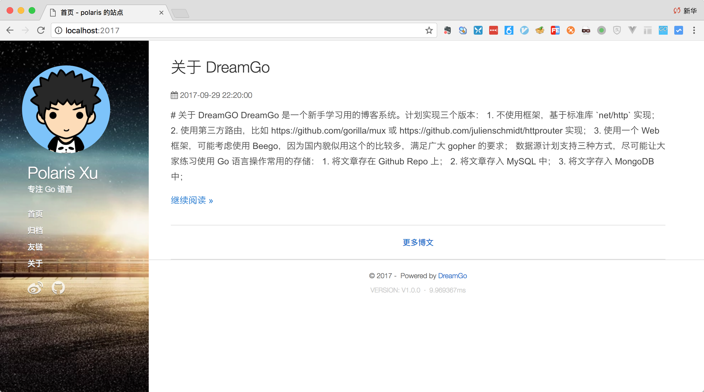

# dreamgo

一个新手学习用的博客系统，用 Go 语言实现自己的梦想。

## 开发计划

### 该博客系统计划采用三种方式实现

1. 不使用框架，直接使用标准库 net/http, branch-std
2. 使用一些基本的路由库，比如 https://github.com/gorilla/mux 或 https://github.com/julienschmidt/httprouter, branch-mux
3. 使用一个 Web 框架，可能考虑使用 Beego，因为国内貌似用这个的比较多，满足广大 gopher 的要求, branch-beego

### 开发时间

2017 年 10 月 1 日开始

## 合作方式

通过 net/http 搭建起来基本的架子后，大家可以以此为基础，加入进来

## 设计说明

1. 数据源（存储），支持三种：
	1. 将文章存在 Github Repo 上；
	2. 将文章存入 MySQL 中；
	3. 将文字存入 MongoDB 中；

2. 支持自定义模板

3. 通过 yaml 做项目配置

## Roadmap

1. master 分支和 branch-std 分支采用 net/http 方式实现。
	- 目前已实现了如下功能：
		1. 基于 http.ServeMux 的简单封装：route.BlogMux，方便写中间件；
		2. 完成基于 github repo 的首页、归档、文章；
		3. 完成日志功能，在main.go中已实例化，其他地方调用logger := logger.Instance()即可；
		4. tag 列表和 tag 文章列表页
		5. 关于页面
	- 还未实现的功能：（大家可以认领，提 issue 告知要开发哪个或加入 qq 群沟通 195831198）
		1. ~~tag 列表和 tag 文章列表页~~；
		2. 友情链接页；
		3. ~~关于页面~~；
		4. 基于 mysql、mongodb 的存储实现，通过配置切换存储；
		5. 管理后台；

2. 使用一些基本的路由库，比如 https://github.com/gorilla/mux 或 https://github.com/julienschmidt/httprouter, branch-mux 还未动工；

3. 使用一个 Web 框架，可能考虑使用 Beego，因为国内貌似用这个的比较多，满足广大 gopher 的要求, branch-beego, 还未动工

## Install

要求：Go 1.13 及以上

**注：如果你是 Windows，请将 `.sh` 的脚本改为 `.bat`**

1. 本项目使用 go module 方式管理依赖；
2. 下载 dreamgo 源码：`git clone https://github.com/go-chinese-site/dreamgo`，比如下载到 ~/dreamgo 中；
3. 构建项目，执行 cd ~/dreamgo，执行 ./build.sh；
4. 启动 dreamgo：bin/dreamgo 或 执行 ./run.sh

通过浏览器访问：http://localhost:2017

## 如何贡献代码

1. fork，编码，pull request；
2. 通过一次 pull request 后，会把你加入该项目的协作者中，之后就可以直接在该项目中写代码、push 了。

